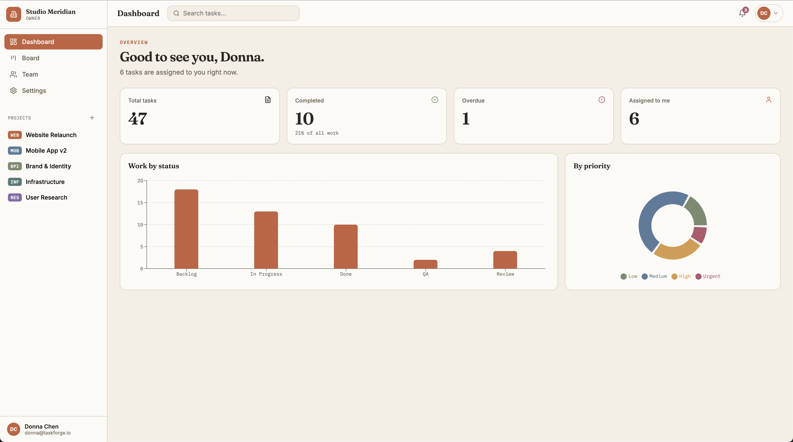

# TaskForge — Frontend

**React single-page client for TaskForge**, a full-stack team project management app — organizations, role-based membership, drag-and-drop Kanban boards, task comments and attachments, dashboard analytics, and in-app notifications. A simplified Trello / Asana / Jira built as a capstone project.

This repo is the **frontend half**: a React 18 + Vite 5 SPA wired directly to the TaskForge REST API. No mock data — every screen reads and writes through real REST calls. The API lives in the sibling repo, **`Capstone-Backend/`** (Express + PostgreSQL, JWT auth, role-based access control), and must be running for the app to work.

The through-line of the design: **every rule is enforced at the right layer.** The database constrains what can exist, the API constrains who can do what, and this UI merely reflects those rules back to the user — hidden buttons are a courtesy, never the security boundary.



---

## Table of Contents

1. [Features](#features)
2. [Tech Stack](#tech-stack)
3. [Project Structure](#project-structure)
4. [Getting Started](#getting-started)
5. [Demo Accounts](#demo-accounts)
6. [Scripts Reference](#scripts-reference)
7. [Design Notes](#design-notes)
8. [Design System](#design-system--drafting-sheet)
9. [Beyond the MVP](#beyond-the-mvp)

---

## Features

**Authentication & accounts**
- Register and log in with email + password; sessions are stateless JWTs held in memory and mirrored to `localStorage`, so a refresh keeps you signed in.
- One-click demo-identity shortcuts on the login screen.
- Self-service account deletion from Settings.

**Organizations & membership**
- Switch between organizations from the sidebar; the last-used workspace is restored on reload.
- Create new organizations (becoming their owner).
- Admins add members by email, change roles, and remove members from the Team view.
- Org deletion is owner-only and requires typing the organization's name to confirm.

**Projects & Kanban boards**
- Projects per organization, each with a short key (e.g. `WEB`), a color, and ordered columns (`Backlog → In Progress → [Review / QA] → Done`).
- Tasks with title, description, priority (`low / medium / high / urgent`), assignee, and due date.
- Drag-and-drop between and within columns using native HTML5 drag events, with optimistic updates persisted through the API's transactional move endpoint.
- Filtering by priority and assignee; org-wide task search from the top bar.

**Collaboration**
- Threaded comments and attachment records in the task drawer.
- A notification bell fed by the API's per-user feed, with mark-read and read-all.

**Analytics dashboard**
- Recharts bar, pie, area, and line charts: task status and priority breakdowns per project, weekly created-vs-completed activity, and monthly cumulative growth — all fed by the API's SQL aggregation endpoints.

---

## Tech Stack

| Layer        | Technology                                                                                   |
| ------------ | -------------------------------------------------------------------------------------------- |
| Framework    | React 18 + Vite 5                                                                             |
| Client state | React Context + hooks (no external state library, no router — view switching is plain state) |
| Drag & drop  | Native HTML5 drag-and-drop events with optimistic updates                                     |
| Charts       | Recharts (bar, pie, area, line)                                                               |
| Icons        | lucide-react                                                                                  |
| Styling      | Hand-rolled CSS design system (`src/styles.css`)                                              |
| Linting      | ESLint 9 with React, hooks, and react-refresh plugins                                         |

---

## Project Structure

```
Capstone-Frontend/
├── index.html                 entry document
├── vite.config.js             dev proxy: /auth, /orgs, /notifications → :3000
├── package.json
├── preview.png                dashboard screenshot used above
└── src/
    ├── main.jsx               mounts <App />
    ├── App.jsx                session bootstrap (GET /auth/me), org
    │                          selection, view routing, app context
    ├── api.js                 fetch wrapper: JWT handling, typed ApiError,
    │                          one function per endpoint
    ├── context.js             AppCtx (React Context)
    ├── constants.js           role ranks, priorities, theme colors, helpers
    ├── styles.css             the entire design system
    └── views/
        ├── AuthGate.jsx       login / register with demo-account shortcuts
        ├── Sidebar.jsx        org switcher, project list, navigation
        ├── Topbar.jsx         global search, notification bell
        ├── Dashboard.jsx      Recharts analytics (bar / pie / area / line)
        ├── Board.jsx          Kanban board with HTML5 drag-and-drop
        ├── TaskDrawer.jsx     task detail: edit, comments, attachments
        ├── TeamView.jsx       member & role administration
        └── SettingsView.jsx   org settings, danger zone (delete org/account)
```

**Request flow, end to end:** a click in a view calls a function in `src/api.js` → the Vite proxy forwards it to the Express API → the backend authenticates the JWT, checks org membership and role rank, and runs the query → the response (or a consistent JSON error shape) comes back, where `api.js` either returns the data or throws a typed `ApiError`.

---

## Getting Started

### Prerequisites

- **Node.js 20+** and npm
- The **TaskForge backend** running on port 3000 — see `Capstone-Backend/` for its setup (PostgreSQL database, `.env`, schema reset, and demo seed)

### 1. Start the backend

In the sibling `Capstone-Backend/` folder:

```bash
npm install
npm run db:reset            # applies db/schema.sql (drops + recreates everything)
npm run db:seed             # 11 users, 5 projects, ~100 tasks with realistic history
npm start                   # → TaskForge API listening on :3000
```

Sanity check: `curl http://localhost:3000/health` → `{"status":"ok"}`.

### 2. Start the frontend

In this folder, in a second terminal:

```bash
npm install
npm run dev                 # → http://localhost:5173
```

The Vite dev server proxies `/auth`, `/orgs`, and `/notifications` to the API on port 3000 (adjust `vite.config.js` if your API runs elsewhere), so the client can use relative URLs with no CORS setup.

### 3. Sign in

Open <http://localhost:5173> and use a demo account below, or register a fresh account — new registrations are automatically enrolled in the default workspace.

---

## Demo Accounts

All seeded accounts share the password **`password123`**.

| Name        | Email                 | Role   | What you can try                                |
| ----------- | --------------------- | ------ | ----------------------------------------------- |
| Donna Chen  | `donna@taskforge.io`  | Owner  | Everything, including org settings and deletion |
| Marcus Reed | `marcus@taskforge.io` | Admin  | Manage members and projects                     |
| Priya Nair  | `priya@taskforge.io`  | Member | Create, edit, move, and comment on tasks        |
| Leo Park    | `leo@taskforge.io`    | Viewer | Read-only: boards render, mutations are refused |

The role changes what the UI permits — and every permission is enforced server-side by role-guarded routes, not just hidden buttons. Signing in as Leo and replaying a Priya request against the API will get you a `403`.

The seed also creates seven more teammates and five projects (`WEB`, `MOB`, `BPI`, `INF`, `RES`) with backdated activity so the dashboard charts have real shape on first load.

---

## Scripts Reference

| Script            | What it does                            |
| ----------------- | --------------------------------------- |
| `npm run dev`     | Vite dev server with API proxy on :5173 |
| `npm run build`   | Production build to `dist/`             |
| `npm run preview` | Serve the production build locally      |
| `npm run lint`    | ESLint over `src/`                      |

---

## Design Notes

**No router, no state library — deliberately.** `App.jsx` boots the session (`GET /auth/me`), loads the caller's orgs, restores the last-used workspace from `localStorage`, and exposes everything through a single `AppCtx` context: identity, active org, role-check helper (`can("member")`), view switching, and a `refresh()` version counter that dependent views watch to refetch.

**One API surface.** `src/api.js` is the only file that touches `fetch`. It carries the JWT (memory + `localStorage`), serializes JSON, and throws a typed `ApiError` with the HTTP status so views can react per-status (e.g. treat a `403` differently from a `500`).

**Optimistic drag-and-drop.** The Kanban board uses native HTML5 drag events. On drop, the card moves in local state immediately, then the `move` endpoint persists it; on failure, the board refetches to reconcile. Same pattern the API's contiguous-position model expects.

**Charts from real aggregates.** The dashboard renders Recharts charts fed by the API's SQL aggregation endpoints — nothing is computed client-side from a task dump.

**Role-aware UI.** Roles are ranked `viewer < member < admin < owner`, and the `can(minRole)` helper hides controls the caller can't use — but that's presentation, not protection. Every mutation is re-checked server-side.

---

## Design System — "Drafting Sheet"

An editorial, ledger-inspired aesthetic carried through every chart and piece of UI chrome, implemented entirely in [`src/styles.css`](src/styles.css):

- **Accent:** terracotta `#C4623D`
- **Background:** warm paper `#F4EFE6`
- **Type stack:** Fraunces (display) · Inter (body) · IBM Plex Mono (data & code)

Seeded users and projects each carry a color from the same palette, so avatars, project dots, and chart series stay coherent without any per-component color logic.

---

## Beyond the MVP

Natural next steps on the frontend, roughly in order of value:

- **Real file uploads** for attachments once the API grows binary storage (the metadata model and UI are already in place).
- **Live updates** — WebSocket or SSE so a teammate's drag shows up without a refresh.
- **Column management UI** — the API models ordered columns; the UI currently renders the seeded set.
- **Ownership transfer** — the single-owner invariant is enforced server-side; transferring it is the missing admin flow.

---

*Built by Donna Chen as a full-stack capstone project. The frontend (this repo) and the backend (`Capstone-Backend/`) live side by side as sibling apps, each with its own `package.json` and git history.*
